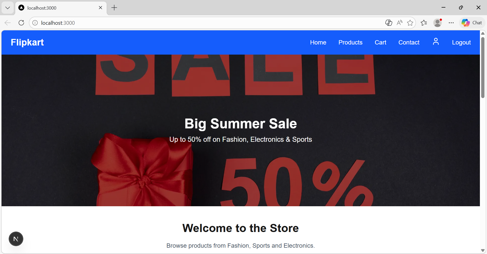
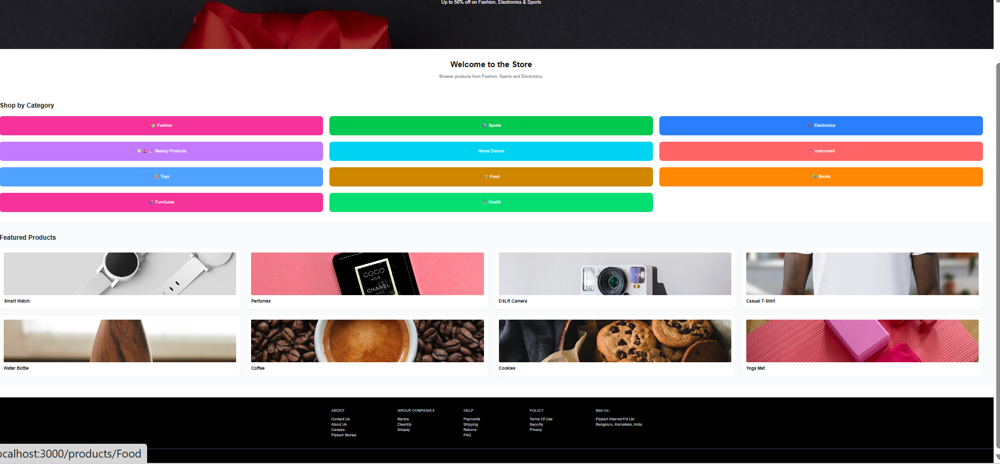
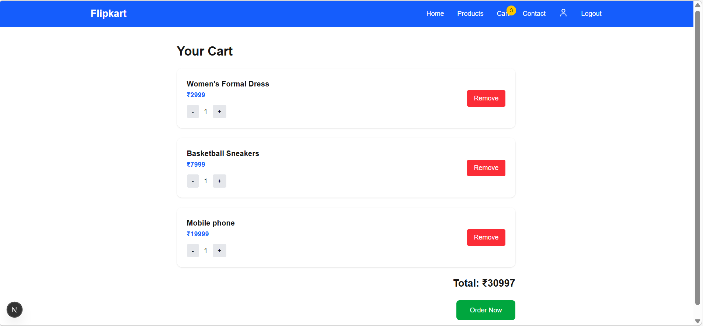

# 🛒 Flipkart Clone (Next.js + React)


A modern **Flipkart-inspired e-commerce web application** built using **Next.js and React**.
This project demonstrates how to build a scalable e-commerce UI using **React component architecture**, **Next.js App Router**, and **global state management with React Context API**.

The application replicates key features of an online shopping platform such as **product browsing, category filtering, add-to-cart functionality, and responsive UI design**.

---

# 🚀 Tech Stack

### ⚛️ Frontend

* **React** – Core library used to build reusable UI components
* **Next.js** – React framework for routing, optimization, and server-side features
* **TypeScript** – Static typing for better maintainability
* **Tailwind CSS** – Utility-first CSS framework for responsive UI

### 🧠 State Management

* **React Context API** – Used for global cart management

### ⚡ Optimization

* **Next/Image** – Optimized image loading
* **App Router** – Fast page navigation in Next.js

---

# ⚛️ React Concepts Used

This project heavily utilizes **React fundamentals**, including:

* Functional Components
* React Hooks

  * `useState`
  * `useEffect`
* **React Context API** for cart state management
* Component-based architecture
* Client-side rendering
* Reusable UI components

Example components used in the project:

* Navbar
* Product Grid
* Category Page
* Login Modal
* Mobile Menu
* Cart System

---

# 📌 Features

✅ Flipkart-style UI layout
✅ Product category browsing
✅ Add to cart functionality
✅ Global cart state using **React Context**
✅ Login modal popup
✅ Responsive design for mobile & desktop
✅ Optimized images with `next/image`
✅ Fast navigation with Next.js App Router

---

# 📸 Screenshots

### 🏠 Home Page


### 📦 Product Page


### 🛒 Cart



---

# 📂 Project Structure

```
flipkart-clone
│
├── app
│   ├── page.tsx
│   ├── category
│   └── layout.tsx
│
├── components
│   ├── Navbar.tsx
│   ├── ProductGrid.tsx
│   ├── LoginModal.tsx
│   └── MobileMenu.tsx
│
├── context
│   └── CartContext.tsx
│
├── data
│   └── products.ts
│
├── types
│   └── product.ts
│
└── public
```

---

# ⚙️ Getting Started

Clone the repository:

```
git clone https://github.com/Pakhi20/flipkart-clone.git
```

Go to the project directory:

```
cd flipkart-clone
```

Install dependencies:

```
npm install
```

Run the development server:

```
npm run dev
```

Open your browser and visit:

```
http://localhost:3000
```

---


```

---

# 📚 Learn More

To learn more about the technologies used:

Next.js Documentation
https://nextjs.org/docs

React Documentation
https://react.dev

---

# 🔮 Future Improvements

* Product search functionality
* User authentication system
* Backend API integration
* Payment gateway integration
* Order history page

---

# 👩‍💻 Author

**Pakhi**

GitHub
https://github.com/Pakhi20

---

⭐ If you like this project, consider giving it a **star on GitHub**!
